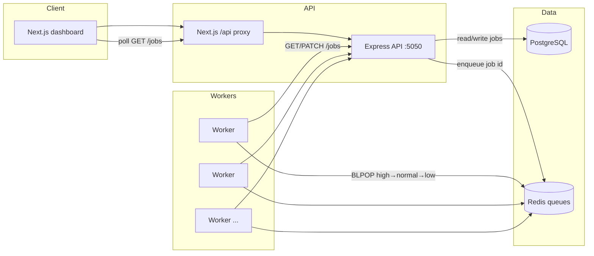

# Distributed Task Scheduling Platform

Capstone project: an end-to-end **distributed task scheduler** with a web dashboard, HTTP API, durable job store, Redis-backed work queues, and horizontally scalable workers.

## Overview

The platform accepts **jobs** from a UI and REST API, persists them in **PostgreSQL**, enqueues work on **Redis** lists by **priority**, and runs **stateless worker** processes that claim jobs, execute real tasks, update status via the API, and **retry** on transient failure. A **Next.js** dashboard polls for live status, errors, and results.

## Problem Statement

Coordinating work across multiple processes requires a clear **separation of concerns**: the API must stay fast and reliable for clients, **work must not be lost** when workers restart, and **ordering and fairness** (e.g. high-priority jobs first) must be enforced without coupling the web tier to long-running execution. This project demonstrates that split using queues, persistence, and idempotent-style status updates suitable for **multiple workers** competing for the same queues.

## Architecture



- **Dashboard** submits jobs and refreshes job state (polling).
- **Express** owns job CRUD, validation, and pushes job IDs to priority-specific Redis lists.
- **PostgreSQL** is the source of truth for job records (status, attempts, result, error, priority).
- **Redis** decouples producers from consumers; workers block on lists in **high → normal → low** order.
- **Workers** are separate Node processes; scaling workers increases throughput without changing the API contract.

## Tech Stack

| Layer | Technology |
|--------|------------|
| Web UI | **Next.js** (React, App Router, Tailwind) |
| Job API | **Node.js** + **Express** |
| Queue | **Redis** (priority lists + blocking pop) |
| Persistence | **PostgreSQL** |
| Execution | **Node.js** worker service |
| Containers | **Docker** (Redis and Postgres dev instances) |

## Core Features

- **Job submission** — `POST /jobs` with type, optional priority (`low` \| `normal` \| `high`; default `normal`).
- **Redis queueing** — Separate lists: `job_queue_high`, `job_queue_normal`, `job_queue_low`.
- **Worker execution** — Blocking pop across lists; real filesystem/CSV work per task type.
- **PostgreSQL persistence** — Jobs table with status lifecycle, JSON results, errors, attempts.
- **Retries** — Configurable `maxAttempts`; failed attempts requeue to the **same** priority list and reset to `pending` until exhausted.
- **Priority scheduling** — Backend enqueues by priority; workers always prefer the high queue.
- **Live dashboard** — Metrics, job table, short result labels, **View details** (full JSON), 2s polling.
- **Real demo tasks** — CSV stats, report files, email batch logs (local files under `backend/`).

## Supported Task Types

| Type | Role |
|------|------|
| `data_processing` | Read `backend/data/sales.csv`, parse CSV, compute row and amount statistics. |
| `report_generation` | Sales stats + write `backend/reports/report_<jobId>.txt`. |
| `email_batch` | Read `backend/data/recipients.csv`, write `backend/logs/email_batch_<jobId>.log`. |

## Local Setup

Prerequisites: **Node.js**, **Docker**, and a `DATABASE_URL` (e.g. in `backend/.env`) pointing at your Postgres instance.

1. **Start Redis and Postgres** (example container names; adjust to match your setup):

   ```bash
   docker start redis-dev postgres-dev
   ```

2. **API** (from repo root):

   ```bash
   cd backend && node index.js
   ```

3. **Worker** (separate terminal; run one or more instances):

   ```bash
   cd worker && node index.js
   ```

4. **Dashboard** (separate terminal):

   ```bash
   npm run dev
   ```

Open the app at **http://localhost:3000** (Next.js). The UI calls `/api/jobs`, which should be rewritten to the Express server on **port 5050** (see `next.config.js`). Ensure `JOBS_URL` / proxy target matches where Express listens.

Environment hints:

- **Backend:** `DATABASE_URL`, `REDIS_URL`, `PORT` (default `5050`).
- **Worker:** `JOBS_URL` (default `http://127.0.0.1:5050/jobs`), `REDIS_URL`.

## Load Test

Burst-submit jobs with mixed types and priorities, then poll until completion or timeout:

```bash
node scripts/load-test.js 200 25
```

The first number is **total jobs**, the second is **POST concurrency**. Same parameters with flags: `node scripts/load-test.js -n 200 -c 25`. Defaults are 200 and 25 if omitted. Use `-h` for full help.

### Sample results

| Workers | Jobs | Total time | Throughput |
|--------:|-----:|-----------:|-----------:|
| 1 | 200 | 16.50 s | **12.12** jobs/sec |
| 3 | 200 | 10.12 s | **19.76** jobs/sec |

Higher worker count improves end-to-end completion time when the queue is the bottleneck, illustrating **horizontal scaling** of consumers.

## Demo Flow

1. Start **Docker** services, **backend**, at least one **worker**, and **`npm run dev`**.
2. Open the dashboard, choose **task type** and **priority**, submit a job; watch status move **pending → running → completed** (or **failed** after retries).
3. Open **View details** on a finished job to inspect full JSON (paths, stats, errors).
4. Optionally run **`scripts/load-test.js`** and observe metrics and the job table under load.

## Why This Is a Distributed Systems Project

The system exhibits classic **distributed systems** concerns: **decoupled components** (API vs workers), **message passing** over Redis instead of in-process calls, **shared durable state** in PostgreSQL with concurrent readers/writers, **at-least-once style delivery** (requeue on failure) bounded by **max attempts**, **priority** across multiple queues, and **elasticity** by adding worker processes. The load test quantifies how **parallel consumers** improve throughput—core motivation for queues and pool-style workers in production platforms.
 
